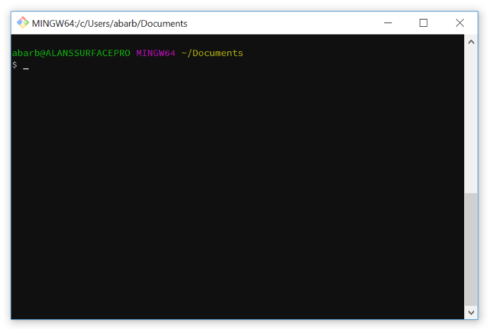

How To Customize The Git For Windows Bash Shell Prompt
======================================================

Have you upgraded to the latest version of Git for Windows and found the default prompt to be a bit annoying with the new added and useless "MINGW32" or "MINGW64"? Perhaps you don't like how it has the username@hostname or maybe just the color scheme.

 "Git for Windows Bash prompt before customization")

I will show you how you can change the prompt in Git for Windows very easily!

The Git for Windows Bash prompt is set using a configuration shell script named *git-prompt.sh* that can be found in the following directory.

`C:\Program Files\Git\etc\profile.d\`

Using a text editor that supports unix style files, such as Notepad++, open the file and you will find something that looks like this.

You will find several lines that can be altered to change the configuration of the shell prompt.

To remove the "MINGW64" you need to remove the following two lines

`PS1="$PS1"'\[\033[35m\]' # change to purple`\
`PS1="$PS1"'$MSYSTEM ' # show MSYSTEM`

I like to also change the first PS1 line which sets the title by removing the

`$TITLEPREFIX:`

and replacing it with

`Bash Prompt (Git for Windows) =>`

If you wish to set colors you will notice several places where the code looks like

`\[033[32m\]`

The 32 is the color code for green. Here is a table of basic color codes

| Code | Color |
| :-: | --- |
| 30 | Black |
| 31 | Red |
| 32 | Green |
| 33 | Yellow |
| 34 | Blue |
| 35 | Magenta |
| 36 | Cyan |
| 37 | White |

After you have saved your changes you can re-open up the bash window and you should find that your prompt now looks like this.

