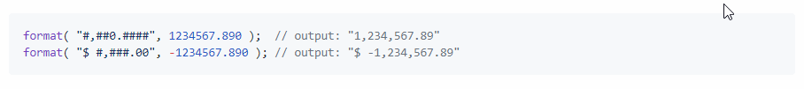

# A userscript adds a copy to clipboard button on hover of markdown code snippets

---

* A button is added each `pre` formatted code block in markdown pages.

* Clicking the button will copy the contents of the code block to the clipboard.

* Buttons are not added to subdomains of GitHub, e.g. help.github.com, because the clipboard script is not loaded on those pages by default.

* Click [this link]() to install.

---

---
