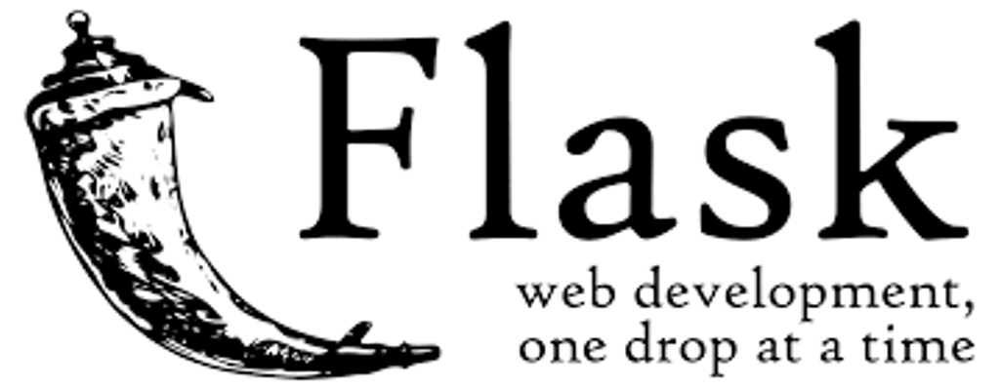

***Flask*** is a lightweight `WSGI`_ web application framework. It is designed
to make getting started quick and easy, with the ability to scale up to
complex applications. It began as a simple wrapper around `Werkzeug`_
and `Jinja`_ and has become one of the most popular Python web
application frameworks.

***Flask*** offers suggestions, but doesn't enforce any dependencies or
project layout. It is up to the developer to choose the tools and
libraries they want to use. There are many extensions provided by the
community that make adding new functionality easy.

---

Installing
----------

Install and update using `pip`_:

```
pip install -U Flask
```

A Simple Example
----------------

```python

from flask import Flask

app = Flask(__name__)

@app.route("/")
def hello():
    return "Hello, World!"
```

```
$ env FLASK_APP=hello.py flask run
     * Serving Flask app "hello"
     * Running on http://127.0.0.1:5000/ (Press CTRL+C to quit)
```

---

Contributing
------------

For guidance on setting up a development environment and how to make a
contribution to Flask, see the `contributing guidelines`_.

.. _contributing guidelines: https://github.com/pallets/flask/blob/master/CONTRIBUTING.rst

---

Links
-----

* Website: https://palletsprojects.com/p/flask/
* Documentation: https://flask.palletsprojects.com/
* Releases: https://pypi.org/project/Flask/
* Code: https://github.com/pallets/flask
* Issue tracker: https://github.com/pallets/flask/issues
* Test status: https://dev.azure.com/pallets/flask/_build
* Official chat: https://discord.gg/t6rrQZH

.. _WSGI: https://wsgi.readthedocs.io
.. _Werkzeug: https://www.palletsprojects.com/p/werkzeug/
.. _Jinja: https://www.palletsprojects.com/p/jinja/
.. _pip: https://pip.pypa.io/en/stable/quickstart/

---
