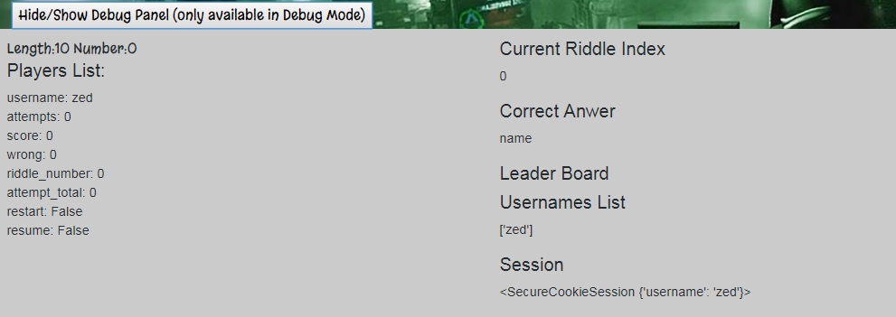
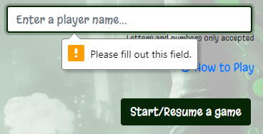
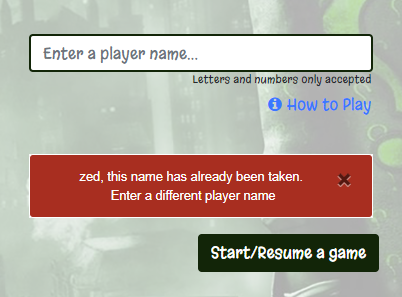
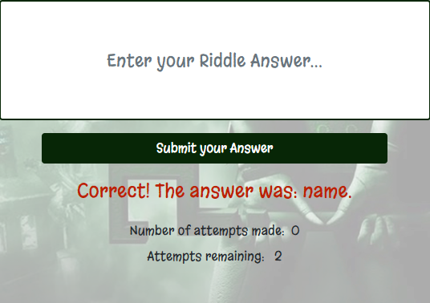
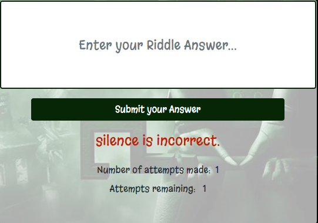
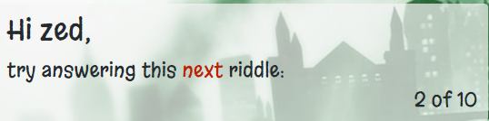
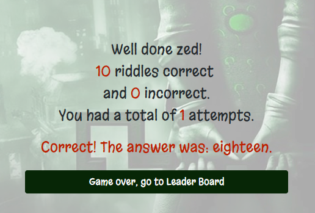

<a name="topofpage"></a>
#   Testing the Riddle-Me-This game

Return to main ReadMe file [ReadMe](README.md)
### Table of Contents

*   [Testing](#testing)
    *   [During development](#during)
    *   [Development/Defensive Design Testing](#devtesting)
*   [Initial Testing](#initial)
    *   [Initial test scenario](#initest)
*   [Ongoing Testing](#ongoing)
    *   [Issues](#issues)
*   [Usability Testing](#usability)
    *   [User Tests](#usertests)
*   [Final Testing](#final)
    *   [Resolutions](#res)   
    *   [User Tests](#finalusertests) 
    *   [Unittesting](#unit)

<a name="testing"></a>
##    Testing
The app was tested on an ongoing basis. Chrome and Chrome Developer Tools were the primary browser and tool used for testing. However, the site was also tested using Firefox and Internet Explorer.

*   CSS was validated using the **CSS Validation Service** provided by The World Wide Web Consortium (W3C): https://jigsaw.w3.org/css-validator/
*   Python code has no pep8 issues

<a name="during"></a>
### During development:
*  **print()** was used extensively for viewing returned data and testing.
*  I created a 'debug panel' in each html template. This panel contained the values of all the variables set
in run.py. It helped me monitor the values as I tested the app in a browser to ensure the correct values were being set.

    |
*   When I wanted to try something new, I saved run.py to the previous_versions folder in the route of my project.
I would continue to develop and refer back to the folder if I needed to quickly revert to or reference code from a previous version.
I realise I could have used git or git branches, but most of the previous_versions files were trial and error, mostly error.
*	Div’s had vibrant background colours so that the developer was easily able to identify them 
*	Each css or html update was viewed in a chrome browser and tested using developer tools at full width resolution and using a variety of device emulators; Galaxy SIII, Galaxy 5, Laptop touch screen, iPhone 5/SE, iPhone 6/7/8, iPhone 6/7/8 Plus, iPhone X, iPad. 
*	Remote debugging using Android, Windows OS and Chrome Dev Tools was used to test each new functionality and new/updated page.

[Top of page](#topofpage)

<a name="devtesting"></a>
### Development/Defensive Design Testing
Testing was carried out continuously while developing the app. 
As per the Defensive Design Strategy described in the Strategy Plan, all form inputs are checked for empty values. Users are messaged if they click a submit button without providing text.
Users are also informed by an on-screen text if their answer was correct or incorrect. 

Custom 404 and 500 error pages were created. These were implemented to give players a friendly error feedback if something errored or a page was not found.

#### Logging in
*check_username()*

This function checks if the username entered is already taken or in session so that user can start/restart/resume a game.

*_The Session takes precedence over the usernames List._*

*   If a new player is _not_ in the usernames list and _does not_ have an active session they enter a username and can continue on to play the game.
*   If a person _is in_ the usernames list and _does not_ have an active session they must enter a new username and can continue on to play the game.
*   If a person _is not_ in the usernames list and _does_ have an active session they can enter their username and continue on to play/restart/resume the game.
*   If a person _is in_ the usernames list but _does not_ have an active session they are asked to choose a different username

| | |
|:---|:---|
|Users are informed if the input box is not completed.||
|If the username is taken.|Users are informed: 'username', this name has already been taken. Enter a different player name<br> |
|Correct answer feedback.||
|Incorrect answer feedback and player is informed of attempt count and attempts remaining||
|Player is informed of riddle count <br>If it’s riddle number 1:<br>try answering this first riddle:<br><br>If it’s riddle number 10:<br>try answering this last riddle:<br><br>If it’s riddle number 2 to 9:<br>try answering this first riddle:<br><br>If it’s the end of the game:<br>there are no more riddles<br>||
|At the end of 10 riddles:<br>Player is informed of their <br>Score<br>Incorrect score<br>Attempt count<br>They are presented with a button to take them to the leader board.||


[Top of page](#topofpage)

<a name="initial"></a>
## Initial  Testing

<a name="initest"></a>
**Test scenario**

Ensured routing was working
```Python
import os
from flask import Flask

app = Flask(__name__)

@app.route('/')
def index():
    return "Hello World"

if __name__ == '__main__':
    app.run(host=os.getenv('IP'), port=int(os.getenv('PORT')), debug=True)
    
    
Confirmed    
```


**Test scenario**

Importing riddle content and ensuring it is available to the browser
    
    1.  Created riddleList.py
    2.  Imported to run.py: from riddlesList import *
    3.	riddles = content()
    4.	Rendered to browser: <br>
    return render_template("index.html", page_title="Riddle-Me-This - Home", riddles=riddles)
    5.	<p>{{riddles.values()[0]}}</p>
    
    
    Confirmed
    
[Top of page](#topofpage)    

<a name="ongoing"></a>
## Ongoing Testing
|Page/functionality|Chrome|Firefox|IE|Chrome Android-Remote Debugging|
|:---|:---:|:---:|:---:|:---:|
|index|Input field looks like button|Same as Chrome|Same as Chrome|Same as Chrome|
|play|General formatting issues|Same as Chrome|Same as Chrome|Same as Chrome
|end|General formatting issues|General formatting issues|General formatting issues|General formatting issues|
|Responsive Design|Help link, Button, misaligned at different resolutions|Same as Chrome|Same as Chrome|Same as Chrome|
|Feedback messages appear|Passed|Passed|Passed|Passed|
|Player score/attempts|Multiple same user instance|Multiple same user instance|Multiple same user instance|Multiple same user instance


|Device/Test|Mobile S|Mobile M|Mobile L|Tablet|Laptop 1024|Laptop L 1440|4K 2560|
|:---|:---:|:---:|:---:|:---:|:---:|:---:|:---:|
|Responsive Design|ongoing css issues|ongoing css issues|ongoing css issues|ongoing css issues|ongoing css issues|ongoing css issues|ongoing css issues|
|Styling|ongoing development issues|ongoing development issues|ongoing development issues|ongoing development issues|ongoing development issues|ongoing development issues|ongoing development issues|
|Error messages|visible|visible|visible|visible|visible|visible|visible
|Bkg image|not filling screen to bottom|not filling screen to bottom|not filling screen to bottom|ok|ok|ok|ok

[Top of page](#topofpage)

<a name="issues"></a>
### Issues
|Issue|Page|Ongoing|
|:---|:---|:---|
|SyntaxWarning: name 'riddle' is assigned to before global declaration|Terminal|not resolved
|First, Next, Last riddle message not working|play|not resolved
|Riddle x of 10 - numbering starts at 0|play|not resolved
|Multiple instance of user score being displayed|play|not resolved
|Multiple instance of user attempts being displayed|play|not resolved
|Multiple players playing simunltaneously affect each other. If Player A gets a riddle correct, Player B is told their correct answer is incorrect|play|not resolved

[Top of page](#topofpage)

<a name="usability"></a>
## Usability Testing
During usability testing, 
*   **Testers commented that the player name input box on the start page was not very obvious.** 
    <br>I redesigned the start page to make the input field more obviously an input field, and I changed the help button to a hyperlink with a font awesome icon. This made the submit button the only button on the page.
*   **Testers noticed that the lowercase version of an answer wasn’t accepted.**<br> So I added .lower() function to the function that gets the player response.

*   **Testers were frustrated at**
    *   not being able to log back into the game with the same user name, 
    *   resume a game after visiting the leader board or 
    *   resume a game after logging back in

As a result the code was overhauled to add these player abilities

[Top of page](#topofpage)

***

<a name="usertests"></a>
### User Tests

**User Test scenario** Modal works as expected

    1.  Click 'How to Play' link on index page. - Confirm Modal appears
    2.  Click Close - Confirm Modal disappears
    
    Confirmed
	

**User Test scenario**

debug=False<br>
Confirm that debug button not visible “Hide/Show Debug Panel (only available in Debug Mode)”


    1.  View Debug panel in browser
    2.  Click View/Hide Debug Panel button
    3.  Confirm debug panel is visible and can be hidden/unhidden
    4.  Edit Run.py - change debug=False
    5.  View Debug panel in browser
    6.  Confirm that Debug panel or 'View/Hide Debug Panel button' is not visible in browser
    
    Confirmed

**User Test scenario** Player Log in

    1.  Player logs in
    2.  Player begins a game
    3.  Player can continue to end of game answering 10 different riddles 
    4.  Score recorded correctly, 
    5.  Attempts recorded correctly
    6.  Total Attempts recored correctly
    
    Confirmed 1, 2, 3, 4, 5
    Failed - 6 Total attempts not recorded correctly
    

**User Test scenario** Player Log in

    1.  Player logs in
    2.  Player begins a game
    3.  Player can continue to end of game answering 10 different riddles 
    4.  Riddles appear in the same order as riddles in source file riddleList.py
    5.  Riddle answers are correct for each riddle question
    
    Confirmed

    
**User Test scenario** Player Log in

    1.  Player logs in
    2.  Player begins a game
    3.  Player visits the home page(index)
    4.  Player visits the leader board
    4.  Player can return to the game page by hitting browser back button and resume their game
    
    Failed game restarts or NoneType error
    
**User Test scenario** Player Log in

    1.  Player logs in
    2.  Player begins a game
    3.  Player abondons a game
    4.  If Player session expired and player name in usernames list, player can resume game
    
    Failed game restarts or NoneType error

    
**User Test scenario** Player Log in

    1.  Player logs in
    2.  Player begins a game
    3.  Player abondons a game
    4.  If Player session not expired and player name in usernames list, player can log back in and resume their game 
    
    Failed game restarts or NoneType error
    
**User Test scenario** Multiple Players

    1.  Player logs into game using Chrome - Player A
    2.  Player logs into game using Firefox - Player B
    3.  Player A begins a game
    4.  Player B begins a game
    5.  Confirm that Player A and Player B can continue their respective games 
    
    Failed Player B told their answer incorrect even though it was correct and vice versa. Player B had their next riddle presented
    even though they were told their first attempt was incorrect.
    
**User Test scenario - 06** Number answers

    1.  Player logs in
    2.  Player begins a game
    3.  Player answers a riddle requiring either a string number or digit answer
    4.  Players answer is accepted and checked and app responds
    
    Failed number(digit) not accepted   

[Top of page](#topofpage)


<a name="final"></a>
##   Final Testing and Resolutions

With every code change no matter how small the app was tested in the browser. My Debug Panel gave me real time feedback on when and 
how my variables, lists and dictionaries were being updated.
Dev Tools in Chrome were used to update the css.
Dev Tools Console was monitored for errors.
But above all the terminal in cloud9 was the primary source of feedback. Variable values were print() to ensure they were being set and their values monitored.

Approximately half way through the project, unittests were written. These were run periodically throughout development.
They were updated to reflect any refactoring of the main run.py code.

Refactoring and moving large chunks of code into their own function was an ongoing process. As a result the unittests were updated to reflect these changes.
New unittests were added when new functions were created in run.py

<a name="res"></a>
### Resolutions
Following user testing by slack members a major overhaul was undertaken to resolve the issue around users being unable to resume a game.
check_username() was rewritten to assess whether a user still had an active session or still in the usernames list.
If they were returning players with a game in session, then the code was written to access their player data in the player_info list and
they were returned to the last riddle they were attempting.

This same approach was used to fix the issue where users could not resume a game after visiting the leader board.
As player data was being stored in a dictionary throughout the duration of a game, it made sense to use this data to track what riddle a
player was answering at any one time.

***

The next major bug was, where multiple players could not play at the same time. This issue was replicated by playing a game at the same time by
two different players in two different browsers. Different browsers were used to ensure that sessions did not overlap.
This issue was the most difficult to resolve. 

Printing out the value of 'riddle' in the check() function was the only way to monitor the exact riddle that was being passed as 
the _next_ riddle. I discovered that by using **global** riddle, the same riddle was being passed to all players.
By putting the value of the current riddle number in a hidden field on the form on play.html, I could pass that riddle number back to the server.
This meant that the riddle number was unique to each player and not dependant upon the **global** riddle number.
This solved my multiple player issue.

[Top of page](#topofpage)


<a name="issues"></a>
### Issues Update
|Issue|Page|Ongoing|
|:---|:---|:---|
|SyntaxWarning: name 'riddle' is assigned to before global declaration|Terminal|resolved|
Solution: I was declaring global riddle too many times in a function. It just needed to be called once at the start

|Issue|Page|Ongoing|
|:---|:---|:---|
|First, Next, Last riddle message not working|play|resolved|

Solution: I needed to put an |int() filter on a variable in the html 

|Issue|Page|Ongoing|
|:---|:---|:---|
|Riddle x of 10 - numbering starts at 0|play|resolved|
Solution: I needed to add 1 to the riddle number as they matched the list index, beginning at 0. riddle.number+1

|Issue|Page|Ongoing|
|:---|:---|:---|
|Multiple instance of user score being displayed|play|resolved
|Multiple instance of user attempts being displayed|play|resolved
Solution: I had been creating a new player in player_info list when a user resumed a game. I rewrote the if statememt to stop this happening.

|Issue|Page|Ongoing|
|:---|:---|:---|
|Multiple players playing simunltaneously affect each other. If Player A gets a riddle correct, Player B is told their correct answer is incorrect|play|resolved
Solution: this was solved by adding a hidden field to the play.html form. It tracked the player riddle number rather than a global riddle number. This stopped 
cross over between players sharing a global variable but rather they had their own way to track their number.

[Top of page](#topofpage)

<a name="finalusertests"></a>
##  User Tests
**User Test scenario** Player Log in

This issue was resolved by moving the line player[total_attempts] +=1 to inside the if statement to check for == 2 attempts

    1.  Player logs in
    2.  Player begins a game
    3.  Player can continue to end of game answering 10 different riddles 
    4.  Score recorded correctly, 
    5.  Attempts recorded correctly
    6.  Total Attempts recored correctly
    
    Confirmed 1, 2, 3, 4, 5, 6
    

**User Test scenario** Player Log in

This issue was resolved by checking if a user had an active session and their current riddle index was used to get their last attempted 
riddle before leaving the play page.

    1.  Player logs in
    2.  Player begins a game
    3.  Player visits the home page(index)
    4.  Player visits the leader board
    4.  Player can return to the game page by hitting browser back button and resume their game
    
    Confirmed
    
**User Test scenario** Player Log in

This issue was resolved by checking if a user had an active session and their current riddle index was used to get their last attempted 
riddle before leaving the play page.

    1.  Player logs in
    2.  Player begins a game
    3.  Player abondons a game
    4.  If Player session expired and player name is in usernames list, player can resume game
    
    Confirmed

    
**User Test scenario** Player Log in

This issue was resolved by checking if a user had an active session and their current riddle index was used to get their last attempted 
riddle before leaving the play page.

    1.  Player logs in
    2.  Player begins a game
    3.  Player abondons a game
    4.  If Player session not expired and player name is in usernames list, player can log back in and resume their game 
    
    Confirmed
    
**User Test scenario** Multiple Players

This major issue was resolved by adding a hidden input field to track the players unique riddle number.
Full explaination under [Final Testing and Resolutions](#res)

    1.  Player logs into game using Chrome - Player A
    2.  Player logs into game using Firefox - Player B
    3.  Player A begins a game
    4.  Player B begins a game
    5.  Confirm that Player A and Player B can continue their respective games 
    
    Confirmed
    
**User Test scenario - 06** Number answers

A helper function called number_to_string() was created. It accepted the player answer.
If the player answer was a digit it was passed to number_to_string(). 
number_to_string() changed the answer to a string e.g. 7 to seven and it was compared to the correct riddle answer.
If the number was not list, the number was returned as a string.


    1.  Player logs in
    2.  Player begins a game
    3.  Player answers a riddle requiring either a string number or digit answer
    4.  Players answer is accepted, checked and the app responds with feedback
    
    Confirmed digit or string accepted


[Top of page](#topofpage)

<a name="unit"></a>
##  Unittesting

Unit testing setup

```Python
def setUp(self):
        client = app.test_client(self)
        self.app = app.test_client()


    # executed after each test
    def tearDown(self):
        pass
```
Test that get_riddle() is returning a riddle dictionary
```Python    ''' TEST 02 '''    
    def test_next_riddle(self):
        """
        Test that the 'get_riddle' function returns a dictionary that has a length greater than 0
        """
        #dictionary = run.get_riddle(5) # will fail as list has 3 riddles
        dictionary = run.get_riddle(2) # will pass as list has 3 riddles
        self.assertGreater(len(dictionary), 0)
```
Test that a session is being created. Test that each html page responds
```Python
    ''' TEST 03 '''
    ''' StackOverflow sourced session information'''
    def test_index(self):
        """
        Test that the a session is created and populated with a value for username
        """
        with self.app as c:
            with c.session_transaction() as sess: #creates session
                sess['username'] = 'bob'
                self.assertEqual(sess['username'], 'bob')
                
        """
        Test that the page is reached
        """        
        #client = app.test_client(self)
        response = self.app.get('/', follow_redirects=True)
        response1 = self.app.get('/play_v4', follow_redirects=True)
        response2 = self.app.get('/end_v4', follow_redirects=True)
        self.assertEqual(response.status_code, 200)
        self.assertEqual(response1.status_code, 200)
        self.assertEqual(response2.status_code, 200)
```

Test that the create_player() creates a dictionary of player in the player_info list
```Python
   ''' TEST 04 '''
    def test_create_player(self):
        """
        Test that the a session is created and populated with a value for username and appended to player_info [] list as dictionary
        """
        with app.test_client() as c:
            with c.session_transaction() as sess:
                sess['username'] = 'bob'
                with app.test_request_context():
                    self.assertEqual(run.create_player(sess['username']), [{'username':'bob', 'score':0, 'attempt':0,  "wrong":0, "riddle_number":0, "attempt_total":0, "restart":False, "resume":False}])

```
Test that check_username() Works for each scenario
```Python''' TEST 05 '''
    def test_check_username(self):
        with self.app as c:
            with c.session_transaction() as sess: #creates session
                sess['username'] = 'bob'
                with app.test_request_context():
                    username = 'bob'
                    usernames = []
                    if not usernames and username == 'bob' and sess['username']:
                        self.assertTrue(run.check_username(username))
                    username = 'bob'
                    usernames = []
                    if usernames and username == 'bob' and not sess['username']: 
                        self.assertFalse(run.check_username(username))                        
                    username = 'bob'
                    usernames = ['bob']
                    if usernames and username == 'bob' and sess['username']:
                        self.assertTrue(run.check_username(username))
                    username = 'bob'
                    usernames = ['bob']
                    if not usernames and username == 'bob':
                        self.assertFalse(run.check_username(username))
```

Test to ensure the helper function number_to_string() takes in a digit and returns a string.
```Python
    ''' TEST 06 '''
    def test_number_to_string(self):
        """
        Test helper function number_to_string()
        """
        test_number = run.number_to_string(2) # take a number return a word
        test_number1 = run.number_to_string(345) # take a number return a string
        test_number2 = run.number_to_string("answer") # take a number return a string
        self.assertEqual(test_number, "two")
        self.assertEqual(test_number1, "345")
        self.assertEqual(test_number2, "answer")
```


|Page/functionality|Issue|Chrome|Firefox|IE|Chrome Android-Remote Debugging|
|:---|:---:|:---:|:---:|:---|:---:|
|index|Input field looks like button|Passed|Passed|Passed|Passed|
|play|General formatting issues|Passed|Passed|Passed|Passed|
|end|General formatting issues|Passed|Passed|Passed|Passed|
|Responsive Design|Help link, Button|Passed|Passed|Passed|Passed
|Feedback messages|Passed|Passed|Passed|Passed|Passed|
|Player score/attempts|Multiple same user instance|Passed Part of Major bug fix|Passed Part of Major bug fix|Passed Part of Major bug fix|Passed Part of Major bug fix|

|Device/Test|Mobile S|Mobile M|Mobile L|Tablet|Laptop 1024|Laptop L 1440|4K 2560|
|:---|:---:|:---:|:---:|:---:|:---:|:---:|:---:|
|Responsive Design|passed|passed|passed|passed|passed|passed|passed|
|Styling|passed|passed|passed|passed|passed|passed|passed|
|Error messages|passed|passed|passed|passed|passed|passed|passed|
|Bkg image|passed|passed|passed|passed|passed|passed|passed|

[Top of page](#topofpage)