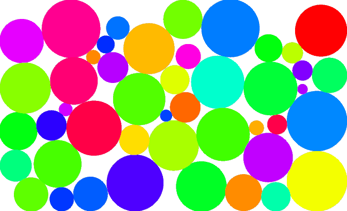

Cymunk's documentation!
=======================

.. warning::

    This extension is still under heavy development, use at your own risks.

Cymunk is a port of `Chipmunk <http://chipmunk-physics.net/>`_, based on
`Cython <http://cython.org>`_. It have the same API and documentation as
`Pymunk <http://code.google.com/p/pymunk/>`_, so all the thanks goes to them in
the first place!

Why another python extension for Chipmunk? This project is autonomous, and
doesn't use ctypes. It will output a single all-in-one python extension. It aim
to be used as a cross-platform python extension, including android (via `Python
For Android <http://github.com/kivy/python-for-android>`_) and iOS (via
`Kivy-ios <http://github.com/kivy/kivy-ios>`_).

Installation
============

::

    $ python setup.py build_ext --inplace

API
===

Functions
---------

.. autofunction:: cymunk.moment_for_box

.. autofunction:: cymunk.moment_for_circle

.. autofunction:: cymunk.moment_for_segment

.. autofunction:: cymunk.reset_shapeid_counter

Variables
---------

.. autodata:: cymunk.__version__

Arbiter
-------

.. autoclass:: cymunk.Arbiter
   :members:
   :undoc-members:

BB
--

.. autoclass:: cymunk.BB
   :members:
   :undoc-members:

Body
----

.. autoclass:: cymunk.Body
   :members:
   :undoc-members:

Circle
------

.. autoclass:: cymunk.Circle
   :members:
   :undoc-members:

Contact
-------

.. autoclass:: cymunk.Contact
   :members:
   :undoc-members:

Poly
----

.. autoclass:: cymunk.Poly
   :members:
   :undoc-members:

Segment
-------

.. autoclass:: cymunk.Segment
   :members:
   :undoc-members:

SegmentQueryInfo
----------------

.. autoclass:: cymunk.SegmentQueryInfo
   :members:
   :undoc-members:

Shape
-----

.. autoclass:: cymunk.Shape
   :members:
   :undoc-members:

Space
-----

.. autoclass:: cymunk.Space
   :members:
   :undoc-members:

Indices and tables
==================

* :ref:`genindex`
* :ref:`modindex`
* :ref:`search`

