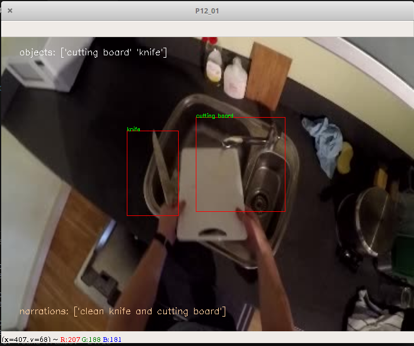

# EPIC-Player

Epic-kitchen dataset [1] video player with all annotation.


## Getting Started

This video player plays a video directly from the frames of EPIC kitchen dataset enriched with objects and actions annotations on each annotated frame. 
<p align="center">

</p>


### Prerequisites

* cv2
* pandas
* glob
* tqdm


### Clone this repo

This repo has annotation files extracted per video for fast indexing.

```
git clone https://github.com/Nachwa/epic-player.git
```

## Run

You can play a specific video with the annotations.
You can also save a video with the its annotations.

### Play an EPIC-Kitchen video

```
python epic_player.py --mode play --video_id P12_01 --root_db_dir /path/to/frames_rgb_flow/
```

Use the following keys to control your video:
```
'Space' or 'Right arrow' : Move forward
'Left arrow' : Move backward
'Up arrow' : double the speed
'Down arrow' : half the speed
```


### Save an EPIC-Kitchen video with its object and action annotations

```
python epic_player.py --mode save --video_id P12_01 --root_db_dir /path/to/frames_rgb_flow/
```

### Additional options

Frame size

```
--size 700 500
```
Speed (number of frames to skip between 2 frame readings)
```
--vspeed 2
```

## License

This project is licensed under the MIT License - see the [LICENSE](LICENSE) file for details

## Reference

* [1] EPIC-kitchen dataset webpage: https://epic-kitchens.github.io/2018

